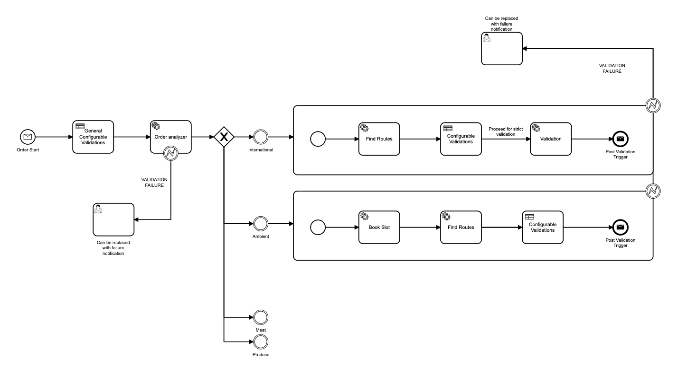
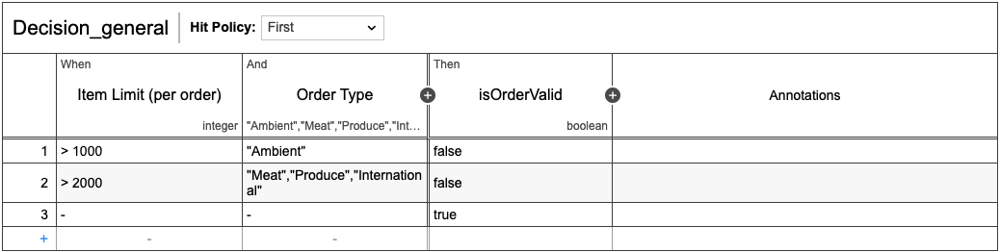
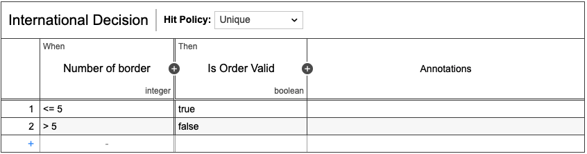
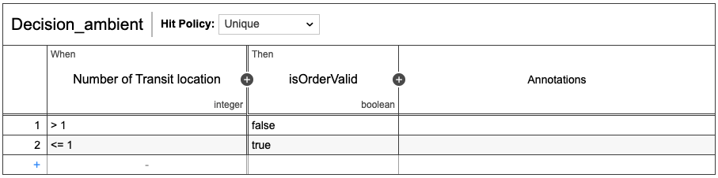
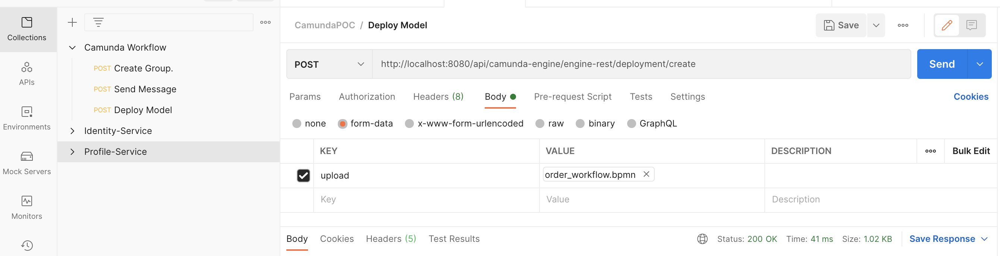
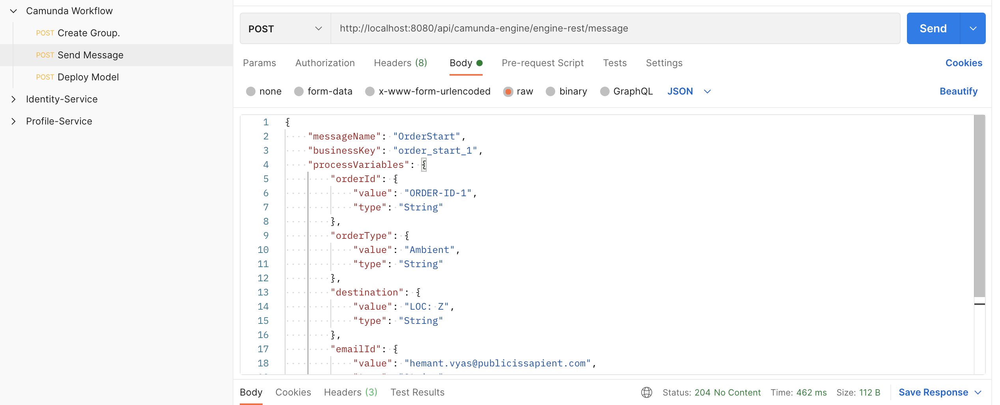

# Camunda for microservices orchestrations

<div align="left"  style="padding-left: 10px">
  
  
  
</div>

End-to-end business processes often involve numerous microservices, and their interaction must be organized.

As the number of microservices involved in a business process increases, however, serious problems can emerge.

* The overall flow of a process will become difficult to monitor and troubleshoot across a group of microservices. Particularly troublesome here is that this problem might not be noticeable when first working with a microservices architecture, but it gradually becomes worse over time as the number of microservices increases. In the worst case, the success of the end-to-end business process is no longer guaranteed due to unforeseen deadlocks and other issues.

* By default, the choreography approach does not provide solutions for handling errors or timeouts, and it instead passes these issues to the client. This makes it difficult to prevent failures in an overall flow and in the worst case scenario can lead to negative customer experiences–for example, when a website displays an error message without offering a solution.

With Camunda, you can avoid these problems without compromising the paradigms of autonomy and loose coupling of microservices.

# Project Overview

In the project we have tried to cover Order processing scenario, and our main focus is on visibility/monitoring of the whole system and its configuration which could be changed in runtime.

## Order workflow:


### Decision tables:

#### General rules


#### International rules


#### Ambient rules


## Components:

* _Workflow Engine_: A spring boot application containing java service tasks along with core camunda engine with UI.
* _External Worker_: A microservice containing external camunda workers (FindRoutes and BookSlot) which are subscribing to different camunda engine topics.
* _Camunda Models_: These are the exports of the process workflow and decision rules from Camunda Modeler.

## Getting Started

### Dependencies

* [Camunda Modeler](https://camunda.com/download/modeler)
* [Docker compose](https://docs.docker.com/compose/)
* [Postman](https://www.postman.com/downloads/)

### Run as it is: [Read runner/readme](runner/readme.md)

### Build and execute from scratch
#### Flow below steps: 

* Build Workflow engine
    ```
    cd workflow-engine
    ./mvnw clean install
    ```
* Build External worker
    ```
    cd external-worker
    ./mvnw clean install
    ```
* Run docker compose (Inside root dir)
    ```
    docker compose up --build
    ```
* Wait for sometime and then inside web browser go to [Camunda UI](http://localhost:8080/api/camunda-engine)
    ```
    Go to http://localhost:8080/api/camunda-engine
    username: admin
    password: password
    ```
* Open postman application
    ```
    Import file present in root directory with name 'camunda-workflow.postman_collection.json'
    ```

Congratulation now camunda workflow engine along with external worker is up and running.

### Deploy and test our camunda models
#### Flow below steps:
  * In postman 'Collections' tab expand 'Camunda Workflow' collection 

    
  * Open 'Deploy Model' and upload all models present in 'workflow-model' directory by selecting each model one by one and sending request.
  You should get Status: 200 OK on every time you press 'Send' button.
    

    &nbsp;
    
  * You can verify the deployed models by going to [Camunda UI](http://localhost:8080/api/camunda-engine) Cockpit. You should see 2 process and 3 Decision tables.

    &nbsp;
    
  * Now to trigger the order flow, In postman send 'Send Message' request. You should get Status: 204 No Content.
    
    &nbsp;
  * Go to [Camunda UI](http://localhost:8080/api/camunda-engine) cockpit to verify if there are any running process instances.

##### Note
  * You can view or modify any model using [Camunda Modeler](https://camunda.com/download/modeler).
  * For testing general rule, you can play with 'numberOfItems' parameter that we are sending in 'Send Message' request, or you can modify the model itself and deploy it.
  * For testing ambient and internal rules you need to modify, and deploy the respective model as values are hardcoded.
    ```
    For Ambient rule: transitLocationCount is 2 [Hardcoded in External Worker]
    For International rule: noOfBorder is 4 [Hardcoded in External Worker]
    ```

## Apache
### Apache 2.0 License
[](https://opensource.org/licenses/Apache-2.0)  
`[](https://opensource.org/licenses/Apache-2.0)`